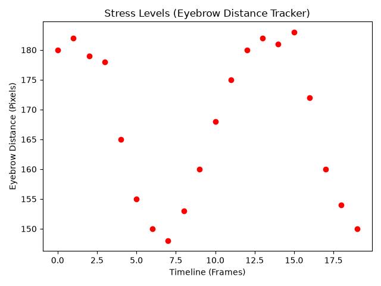

# Real-Time Stress Detection System

> [!NOTE]
> This project was created for a college student during freelance work. It is not intended for commercial use or production. It is maintained for educational and portfolio purposes only.

## Overview
The **Real-Time Stress Detection System** is a computer vision and deep learning application designed to assess stress levels in real-time. It analyzes facial features captured via a standard webcam, combining two key biological markers of stress:
1. **Eye Blink Rate**: Tracked through the Eye Aspect Ratio (EAR) using dlib's landmark detector. High blink rates or extreme deviation can indicate fatigue or cognitive load.
2. **Eyebrow Distance & Facial Expressions**: Frowning causes eyebrows to move closer together. The system measures eyebrow distance changes alongside an emotion classification CNN model (mini-XCEPTION trained on FER-2013) to classify states like anger, sadness, fear, or surprise into stressed or unstressed indicators.

### Features
* **Blink Detection**: Real-time EAR computation and blink counting.
* **Eyebrow Trackers**: Dynamic normalization of eyebrow distances to gauge frowning indicators.
* **Emotion-to-Stress Mapping**: Maps facial expressions (`scared`, `sad` mapped to `stressed`, others to `not stressed`).
* **Webcam Integration**: Real-time feed streaming with overlay text using OpenCV.
* **Statistical Plotting**: End-of-session stress plot generation using Matplotlib.

---

## Architecture
The system comprises data processing, deep learning model execution, and real-time landmark calculation:

```
[Webcam Feed] ---> [Dlib Face Detection] ---> [Facial Landmark Localization (68 points)]
                                             |
                                             +---> [Eye Aspect Ratio Calculation] ---> [Blink Counter]
                                             |
                                             +---> [Eyebrow Distance Tracking] ----+
                                             |                                     |---> [Stress Metric Evaluation]
                                             +---> [Facial ROI Extraction]         |
                                                          |                        |
                                                          v                        v
                                               [mini-XCEPTION Model] ---> [Stress Classification overlay]
```

### Major Modules
* **[blink_detection.py](file:///e:/ALL%20Projects/Stress-Detection/Stress-Detection/Code/blink_detection.py)**: Captures webcam input, detects eye landmarks, computes EAR, and counts blinks.
* **[eyebrow_detection.py](file:///e:/ALL%20Projects/Stress-Detection/Stress-Detection/Code/eyebrow_detection.py)**: Tracks eyebrow distance, runs emotion recognition inference, computes the stress metric, and plots stress metrics upon exit.
* **[cnn.py](file:///e:/ALL%20Projects/Stress-Detection/Stress-Detection/Code/cnn.py)**: Defines CNN models (`mini_XCEPTION`, `tiny_XCEPTION`, `big_XCEPTION`) for classification.
* **[load_and_process.py](file:///e:/ALL%20Projects/Stress-Detection/Stress-Detection/Code/load_and_process.py)**: Preprocessing pipeline for FER-2013 dataset training.
* **[emotion_recognition.py](file:///e:/ALL%20Projects/Stress-Detection/Stress-Detection/Code/emotion_recognition.py)**: Model training script.

---

## Technologies
* **Language**: Python 3.11+
* **Frameworks & Libraries**: OpenCV, TensorFlow/Keras, Dlib, NumPy, Pandas, SciPy, Matplotlib, Imutils, Scikit-learn

---

## Installation

### Local Setup
1. **Clone the repository**:
   ```bash
   git clone <repository-url>
   cd Stress-Detection/Code
   ```

2. **Set up a Virtual Environment**:
   ```bash
   python -m venv venv
   venv\Scripts\activate  # Windows
   source venv/bin/activate  # macOS/Linux
   ```

3. **Install Dependencies**:
   ```bash
   pip install -r requirements.txt
   ```
   *Note: On Windows, the precompiled wheel library `dlib-bin` is used to bypass the need for Visual Studio C++ Build Tools and CMake.*

---

## Usage

### 1. Real-Time Eye Blink Detection
To start the webcam-based eye aspect ratio and blink tracking:
```bash
python blink_detection.py
```
* **Press `q`** to close the window.

### 2. Real-Time Eyebrow & Emotion Stress Detection
To execute the combined eyebrow movement tracker and emotion-stress evaluation:
```bash
python eyebrow_detection.py
```
* **Press `q`** to close the window and view the stress level chart.

#### Sample Session Output Graph


---

## Folder Structure
```
.
├── __pycache__/                              # Compiled python cache
├── _mini_XCEPTION.102-0.66.hdf5              # Pretrained emotion recognition model weights
├── shape_predictor_68_face_landmarks.dat     # Dlib 68-point face landmark file
├── blink_detection.py                        # Blink detection module
├── cnn.py                                    # CNN architecture configuration definitions
├── emotion_recognition.py                    # Classifier training pipeline script
├── eyebrow_detection.py                      # Eyebrow and stress metric calculation module
├── load_and_process.py                       # FER-2013 dataset processor
├── requirements.txt                          # Python dependencies list
├── .gitignore                                # Git ignore configuration rules
├── LICENSE                                   # MIT license
└── README.md                                 # Project documentation
```

---

## Development Guide
* **Debugging**: You can modify webcam capture device indices in `cv2.VideoCapture(0)` to custom camera ids (e.g. `1` or `2`) if you have external webcams.
* **Model Training**: Place the [FER-2013 dataset](https://www.kaggle.com/datasets/msambare/fer2013) inside a folder `fer2013/fer2013/fer2013.csv` and run:
  ```bash
  python emotion_recognition.py
  ```

---

## Troubleshooting
* **Webcam not opening**: Ensure no other application (like Zoom or Teams) is using the webcam. Verify that your camera index is correctly set in `cv2.VideoCapture(0)`.
* **Dlib File Missing**: The application relies on `shape_predictor_68_face_landmarks.dat`. If not found, download it from the official dlib website or models database.
* **TensorFlow warnings**: TensorFlow might output CPU instruction warnings. These are standard and do not affect application functionality.
